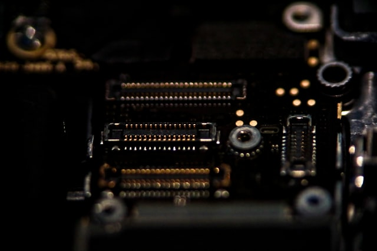

  
  <h1>Project Outset</h1>
  
  

    A personal website built using vanilla HTML, CSS, and Javascript, without frameworks or templates.
  

  
<!-- Badges -->

  
  
  
  
  
  

<!-- 
<h4>
    <a href="https://github.com/awworthy/outset/">View Demo</a>
   · 
    <a href="https://github.com/awworthy/outset">Documentation</a>
   · 
    <a href="https://github.com/awworthy/outset/issues/">Report Bug</a>
   · 
    <a href="https://github.com/awworthy/outset/issues/">Request Feature</a>
  </h4>
-->

 

<!-- Table of Contents -->
# :notebook_with_decorative_cover: Table of Contents

- [About the Project](#star2-about-the-project)
  * [Color Reference](#art-color-reference)
- [Roadmap](#compass-roadmap)
- [Contributing](#speechballoon-contributing)
- [License](#warning-license)
- [Contact](#handshake-contact)
- [Acknowledgements](#gem-acknowledgements)
  

<!-- About the Project -->
## :star2: About the Project

The intent of this project is to build on my learning of HTML, CSS and Javascript through the development of a personal portfolio website with vanilla languages only -- no frameworks included or used in setup.

When it is completed it will replace my current [website](https://www.alexworthy.ca/).

All references to inspiration, information, or otherwise will be tracked in this file for myself and others.

<!-- Color Reference -->
### :art: Color Reference

| Color             | Hex                                                               |
| ----------------- | ----------------------------------------------------------------- |
| Background Color  |  #293241  |
| Primary Color     |  #3D5A80  |
| Secondary Color   |  #98C1D9  |
| Accent Color      |  #EE6C4D  |
| Text Color        |  #E0FBFC  |

<!-- Roadmap -->
## :compass: Roadmap

* [x] Create README and setup initial repo
* [x] Add text/information to build out HTML file
* [ ] Finalize images and color scheme of the project
* [ ] Configure CSS file for styling the webpage
* [ ] Consider using some JavaScript for animations

<!-- Contributing -->
## :speech_balloon: Contributing

Contributions are currently closed

<!-- License -->
## :warning: License

Distributed under [MIT License](./LICENSE)

<!-- Contact -->
## :handshake: Contact

Alex Worthy - [@awworthy_ca](https://twitter.com/awworthy_ca) - alex.w.worthy@gmail.com

Project Link: [https://github.com/awworthy/outset](https://github.com/awworthy/outset)

<!-- Acknowledgments -->
## :gem: Acknowledgements

 - README Template by [Louis3797](https://github.com/Louis3797/awesome-readme-template)
 - README Header by [Patrick Hendry on Unsplash](https://unsplash.com/photos/A1v0-iH3T5A)
 - "Hand on Steering Wheel" by [whykei on Unsplash](https://unsplash.com/photos/8e2gal_GIE8)
 <!-- - Webpage header by [Kyle Sung on Unsplash](https://unsplash.com/photos/oQuP_XBjOMY) -->
 - Keyboard Photo by <a href="https://unsplash.com/@miguelalcantara?utm_source=unsplash&utm_medium=referral&utm_content=creditCopyText">Miguel Alcântara</a> on <a href="https://unsplash.com/s/photos/laptop?utm_source=unsplash&utm_medium=referral&utm_content=creditCopyText">Unsplash</a>
 <!-- - Laptop (side) Photo by <a href="https://unsplash.com/@blocks?utm_source=unsplash&utm_medium=referral&utm_content=creditCopyText">blocks</a> on <a href="https://unsplash.com/s/photos/laptop?utm_source=unsplash&utm_medium=referral&utm_content=creditCopyText">Unsplash</a> -->